# 经济学全景指南：从微观决策到宏观趋势，读懂 2026 年的世界经济

> **编者按**：这是一个充满不确定性的时代——AI 革命重塑就业市场，绿色转型重构产业格局，地缘政治改变贸易流向。掌握经济学思维，比以往任何时候都更重要。本文基于经济学学习平台的核心内容，为你呈现一幅完整的经济学知识图谱。

---

## 目录

1. [什么是经济学？](#一什么是经济学)
2. [经济学学科体系全景图](#二经济学学科体系全景图)
3. [微观经济学：个体决策的奥秘](#三微观经济学个体决策的奥秘)
4. [宏观经济学：理解整体经济运行](#四宏观经济学理解整体经济运行)
5. [中观经济学：产业与区域的桥梁](#五中观经济学产业与区域的桥梁)
6. [国际经济学：全球化时代的贸易与金融](#六国际经济学全球化时代的贸易与金融)
7. [新兴经济学分支：数字、AI 与绿色革命](#七新兴经济学分支数字 ai 与绿色革命)
8. [行为经济学：当心理学遇见经济学](#八行为经济学当心理学遇见经济学)
9. [经济史：从历史看未来](#九经济史从历史看未来)
10. [生活中的经济学：实用思维工具](#十生活中的经济学实用思维工具)

---

## 一、什么是经济学？

### 1.1 经济学的核心定义

**经济学（Economics）** 是研究人类社会在各个发展阶段的各种经济活动和经济关系，研究如何有效配置**稀缺资源**以满足人们**无限需求**的社会科学。经济学本质上是一门研究**选择**的学科。

### 1.2 经济学的三大基本问题

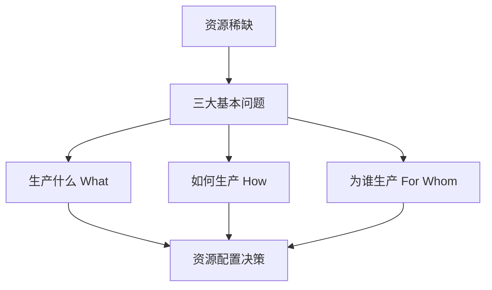
```mermaid
flowchart TD
    A[资源稀缺] --> B[三大基本问题]
    B --> C[生产什么 What]
    B --> D[如何生产 How]
    B --> E[为谁生产 For Whom]
    C --> F[资源配置决策]
    D --> F
    E --> F
```

这三个问题贯穿所有经济活动：
- **生产什么**：决定将资源用于生产哪些商品和服务
- **如何生产**：选择生产技术和组织方式
- **为谁生产**：决定产出的分配方式

### 1.3 经济学的核心概念：机会成本

> **机会成本**：做出一项选择时所放弃的其他最佳替代方案的价值。

**例子**：上大学的机会成本不仅是学费，还包括你如果工作可以赚到的工资。理解机会成本有助于做出更理性的决策。

---

## 二、经济学学科体系全景图

### 2.1 按研究层次划分

| 层次 | 研究对象 | 核心内容 | 典型问题 |
|------|----------|----------|----------|
| **微观经济学** | 个体经济单位 | 消费者、厂商、市场 | 价格如何决定？企业如何定价？ |
| **中观经济学** | 产业与区域 | 产业结构、区域经济、产业集群 | 产业政策如何制定？区域如何发展？ |
| **宏观经济学** | 整体经济 | GDP、通胀、失业、政策 | 经济增长的动力？如何调控经济？ |

### 2.2 经济学分支全景图

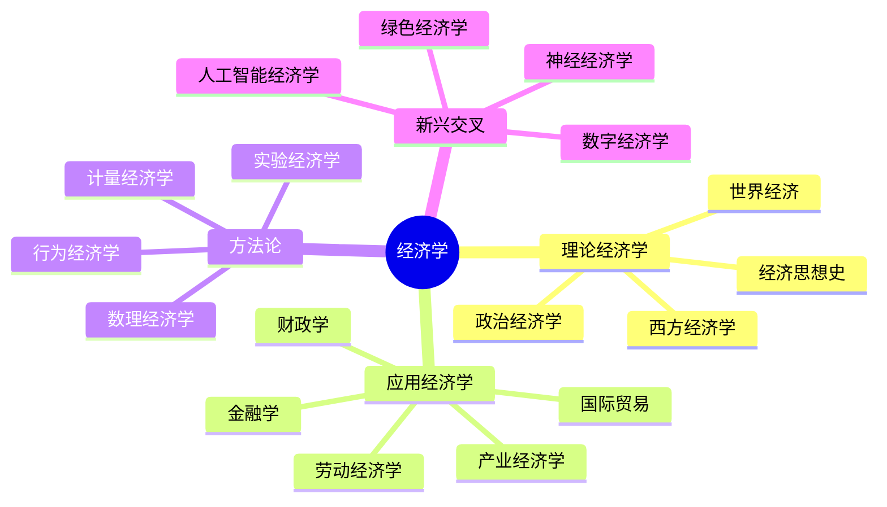
```mermaid
mindmap
  root((经济学))
    理论经济学
      政治经济学
      经济思想史
      西方经济学
      世界经济
    应用经济学
      金融学
      财政学
      国际贸易
      产业经济学
      劳动经济学
    方法论
      计量经济学
      数理经济学
      实验经济学
      行为经济学
    新兴交叉
      数字经济学
      绿色经济学
      人工智能经济学
      神经经济学
```

### 2.3 经济学发展历程与主要学派

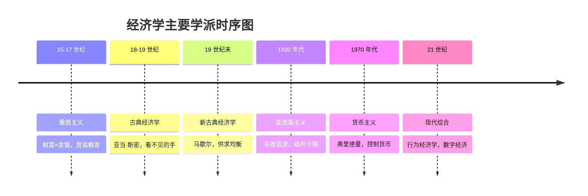
```mermaid
timeline
    title 经济学主要学派时序图
    15-17 世纪 : 重商主义 : 财富=金银，贸易顺差
    18-19 世纪 : 古典经济学 : 亚当·斯密，看不见的手
    19 世纪末 : 新古典经济学 : 马歇尔，供求均衡
    1930 年代 : 凯恩斯主义 : 有效需求，政府干预
    1970 年代 : 货币主义 : 弗里德曼，控制货币
    21 世纪 : 现代综合 : 行为经济学，数字经济
```

### 2.4 主要经济学家及其贡献

| 经济学家 | 时期 | 代表作 | 主要贡献 |
|----------|------|--------|----------|
| **亚当·斯密** | 1723-1790 | 《国富论》 | "看不见的手"、劳动分工理论 |
| **大卫·李嘉图** | 1772-1823 | 《政治经济学及赋税原理》 | 比较优势理论、地租理论 |
| **卡尔·马克思** | 1818-1883 | 《资本论》 | 剩余价值理论、历史唯物主义 |
| **阿尔弗雷德·马歇尔** | 1842-1924 | 《经济学原理》 | 供求均衡、弹性理论 |
| **约翰·梅纳德·凯恩斯** | 1883-1946 | 《就业、利息和货币通论》 | 有效需求理论、政府干预 |
| **米尔顿·弗里德曼** | 1912-2006 | 《资本主义与自由》 | 货币主义、自由市场 |

---

## 三、微观经济学：个体决策的奥秘

### 3.1 消费者行为理论

#### 消费者决策流程

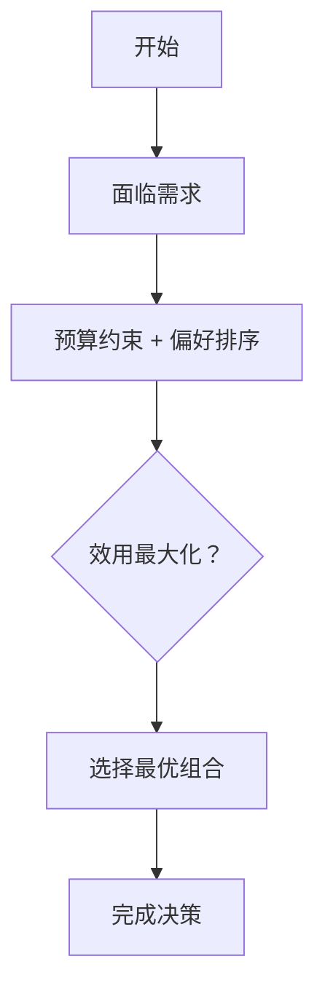
```mermaid
flowchart TD
    A[开始] --> B[面临需求]
    B --> C[预算约束 + 偏好排序]
    C --> D{效用最大化？}
    D --> E[选择最优组合]
    E --> F[完成决策]
```

#### 核心概念：边际效用递减规律

> 随着消费者对某种商品消费量的增加，每增加一单位该商品所带来的额外满足感（边际效用）会逐渐减少。

**这就是为什么**：
- 第一杯水最解渴，后面的水杯效用递减
- 自助餐吃到后面，每多吃一口的满足感下降
- "第二杯半价"的定价策略基于此原理

#### 需求定律：价格与需求量的关系

| 价格变动 | 需求量变动 | 收入效应 | 替代效应 |
|----------|------------|----------|----------|
| 价格上升 ↑ | 需求量下降 ↓ | 实际收入减少 | 转向替代品 |
| 价格下降 ↓ | 需求量上升 ↑ | 实际收入增加 | 减少替代品 |

> **关键区分**：需求变化 vs 需求量变化
> - **需求量变化**：价格变动引起，表现为**沿同一条需求曲线的移动**
> - **需求变化**：非价格因素（收入、偏好、预期等）引起，表现为**整条需求曲线的平移**

### 3.2 生产者行为理论

#### 生产决策时序

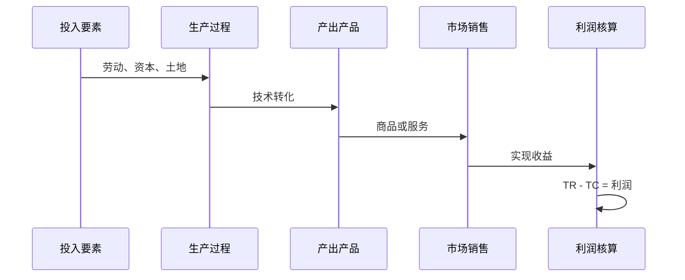
```mermaid
sequenceDiagram
    participant A as 投入要素
    participant B as 生产过程
    participant C as 产出产品
    participant D as 市场销售
    participant E as 利润核算
    
    A->>B: 劳动、资本、土地
    B->>C: 技术转化
    C->>D: 商品或服务
    D->>E: 实现收益
    E->>E: TR - TC = 利润
```

#### 成本分类表

| 成本类型 | 定义 | 短期/长期 | 示例 |
|----------|------|-----------|------|
| **固定成本 (FC)** | 不随产量变化的成本 | 短期 | 厂房租金、设备折旧 |
| **可变成本 (VC)** | 随产量变化的成本 | 短期 | 原材料、工人工资 |
| **总成本 (TC)** | FC + VC | 短期/长期 | 全部生产成本 |
| **边际成本 (MC)** | 增加一单位产量的成本增量 | 短期/长期 | ΔTC/ΔQ |

#### 利润最大化条件

> **MR = MC**（边际收益 = 边际成本）

这是厂商决策的黄金法则：当增加一单位产量带来的收益等于其成本时，利润达到最大。

### 3.3 市场结构与均衡

#### 供求均衡的实现机制

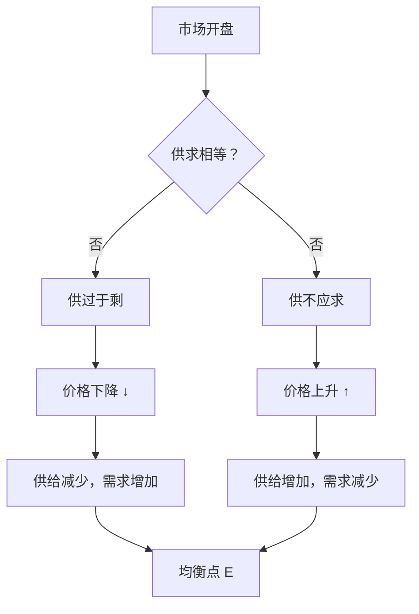
```mermaid
flowchart TD
    A[市场开盘] --> B{供求相等？}
    B -->|否 | C[供过于剩]
    B -->|否 | D[供不应求]
    C --> E[价格下降 ↓]
    D --> F[价格上升 ↑]
    E --> G[供给减少，需求增加]
    F --> H[供给增加，需求减少]
    G --> I[均衡点 E]
    H --> I
```

#### "看不见的手"调节机制

> 市场价格自动调节供求：当供过于求时，价格下降，刺激需求、抑制供给；当供不应求时，价格上升，抑制需求、刺激供给。最终趋向均衡点，无需中央计划。

#### 四种市场结构对比

| 市场类型 | 厂商数量 | 产品差异 | 进入壁垒 | 价格控制力 | 现实例子 |
|----------|----------|----------|----------|------------|----------|
| **完全竞争** | 无数 | 同质 | 无 | 无 | 农产品市场 |
| **垄断竞争** | 很多 | 有差异 | 低 | 有限 | 餐饮、服装 |
| **寡头垄断** | 少数几家 | 有/无差异 | 高 | 较大 | 电信、航空 |
| **完全垄断** | 一家 | 唯一产品 | 极高 | 很大 | 公用事业 |

---

## 四、宏观经济学：理解整体经济运行

### 4.1 国民收入核算

#### GDP 核算方法

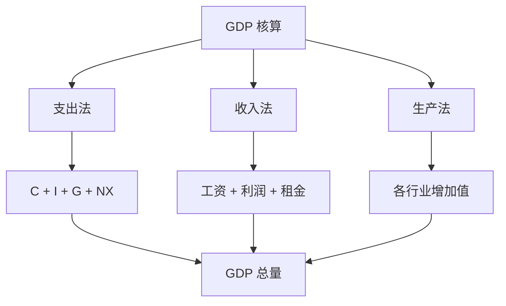
```mermaid
flowchart TD
    A[GDP 核算] --> B[支出法]
    A --> C[收入法]
    A --> D[生产法]
    B --> E[C + I + G + NX]
    C --> F[工资 + 利润 + 租金]
    D --> G[各行业增加值]
    E --> H[GDP 总量]
    F --> H
    G --> H
```

#### GDP 公式

> **GDP = C + I + G + NX**
> - **C**：消费（居民个人消费）
> - **I**：投资（企业固定资产投资 + 存货投资）
> - **G**：政府购买（政府消费 + 公共投资）
> - **NX**：净出口（出口 - 进口）

#### 主要宏观经济指标

| 指标 | 英文 | 定义 | 计算公式 | 意义 |
|------|------|------|----------|------|
| **国内生产总值** | GDP | 一国境内生产的最终产品和服务总值 | C + I + G + NX | 经济规模 |
| **国民生产总值** | GNP | 一国国民拥有的生产要素产出总值 | GDP + 国外净要素收入 | 国民收入 |
| **消费者价格指数** | CPI | 一篮子消费品价格变动 | 加权平均 | 通货膨胀 |
| **失业率** | Unemployment Rate | 劳动力中失业者比例 | 失业人数/劳动力总数 | 就业状况 |

### 4.2 经济增长理论

#### 经济增长因素及贡献

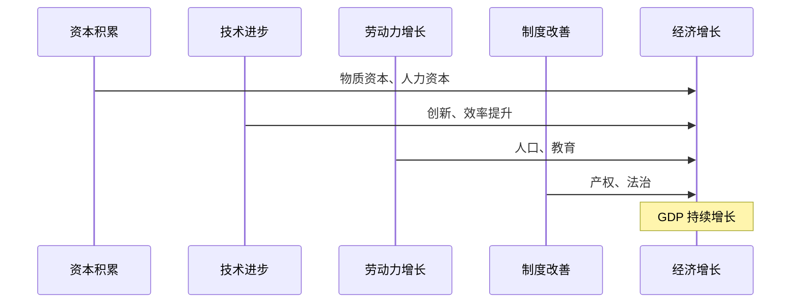
```mermaid
sequenceDiagram
    participant A as 资本积累
    participant B as 技术进步
    participant C as 劳动力增长
    participant D as 制度改善
    participant E as 经济增长
    
    A->>E: 物质资本、人力资本
    B->>E: 创新、效率提升
    C->>E: 人口、教育
    D->>E: 产权、法治
    Note over E: GDP 持续增长
```

#### 各增长因素详解

| 增长因素 | 影响机制 | 贡献度 | 何时占优势 | 后果 |
|----------|----------|--------|------------|------|
| **物质资本积累** | 机器、设备、基础设施增加 → 生产能力提升 | 短期 30-40% | 工业化初期、经济起飞阶段 | ✓ 快速工业化 ✗ 边际收益递减 |
| **人力资本积累** | 教育、培训 → 劳动力素质提高 → 生产率提升 | 长期 20-30% | 知识经济时代、产业升级期 | ✓ 创新驱动增长 ✗ 回报周期长 |
| **技术进步** | 创新、效率提升 → 同样投入产出更多 | 长期 50%+ | 发达经济体、后工业化时代 | ✓ 可持续增长 ✗ 创造性破坏导致失业 |
| **劳动力增长** | 人口增加 → 劳动供给增加 → 总产出增加 | 短期 10-20% | 人口红利期、移民国家 | ✓ 总 GDP 增长 ✗ 人均 GDP 未必增长 |
| **制度质量** | 产权保护、法治、政府效率 → 激励投资和创新 | 基础性作用 | 所有阶段，尤其是转型期 | ✓ 长期增长基础 ✗ 制度变革阻力大 |

#### 不同发展阶段的主导因素

> **低收入阶段**：自然资源和廉价劳动力是主要优势
> 
> **中等收入阶段**：资本积累和工业化驱动增长
> 
> **高收入阶段**：技术进步和人力资本成为核心动力

**关键洞察**：一个国家不能永远依赖同一因素增长。成功跨越"中等收入陷阱"的国家都实现了从要素驱动向创新驱动的转型。

#### 索洛模型 vs 内生增长理论

**索洛模型（Solow Model）** 由美国经济学家罗伯特·索洛于 1956 年提出，是现代经济增长理论的基石。

**核心公式**：
> **Y = A · F(K, L)**
> - Y: 产出
> - K: 资本
> - L: 劳动
> - A: 技术水平（**外生给定**）

**索洛模型的核心结论**：
- 资本边际收益递减
- 经济最终会达到稳态，人均资本和人均产出不再增长
- 储蓄率只能提高稳态的产出水平，不能提高稳态的增长率
- **技术进步是唯一源泉**（但模型无法解释技术进步从何而来）

**内生增长理论（Endogenous Growth Theory）** 1980 年代由保罗·罗默、罗伯特·卢卡斯等发展起来。

**核心突破**：**技术进步是内生的**——经济系统内部的因素（如 R&D 投资、人力资本积累、知识溢出）可以决定技术进步的速度。

**AK 模型公式**：
> **Y = A · K**（资本边际收益不变，经济可以持续增长）

**两种理论的对比**：
- **索洛模型**：技术进步是"天上掉下来的"——经济像一辆自行车，风来就来
- **内生增长理论**：技术进步是"自己造出来的"——经济像一辆汽车，可以踩油门来加速

### 4.3 经济周期与波动

#### 经济周期的四个阶段

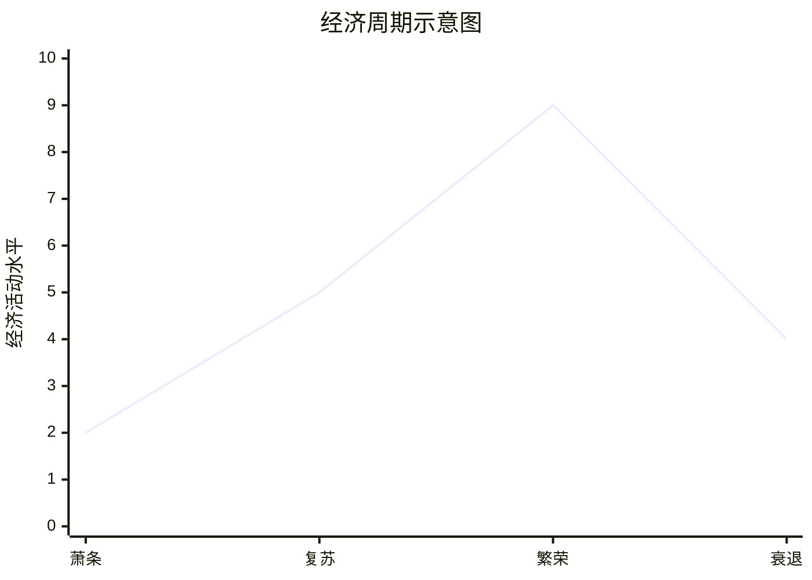
```mermaid
xychart-beta
    title "经济周期示意图"
    x-axis ["萧条", "复苏", "繁荣", "衰退"]
    y-axis "经济活动水平" 0 --> 10
    line [2, 5, 9, 4]
```

| 阶段 | 特征 | 政策应对 |
|------|------|----------|
| **萧条** | GDP 下降、失业率高、投资低迷 | 扩张性财政和货币政策 |
| **复苏** | GDP 回升、就业改善、信心恢复 | 适度支持，避免过热 |
| **繁荣** | GDP 高增长、低失业、通胀压力 | 紧缩政策，防止泡沫 |
| **衰退** | GDP 下滑、失业上升、需求不足 | 刺激政策，稳定预期 |

### 4.4 宏观经济政策

#### 财政政策与货币政策对比

| 政策类型 | 工具 | 传导机制 | 时滞 | 2026 年新特点 |
|----------|------|----------|------|---------------|
| **财政政策** | 政府支出、税收 | 直接影响总需求 | 决策时滞长，执行时滞短 | 绿色财政、数字税收 |
| **货币政策** | 利率、准备金率、公开市场操作 | 影响信贷成本 | 决策时滞短，执行时滞长 | 数字货币、非常规政策 |

#### 政策组合的四种情景

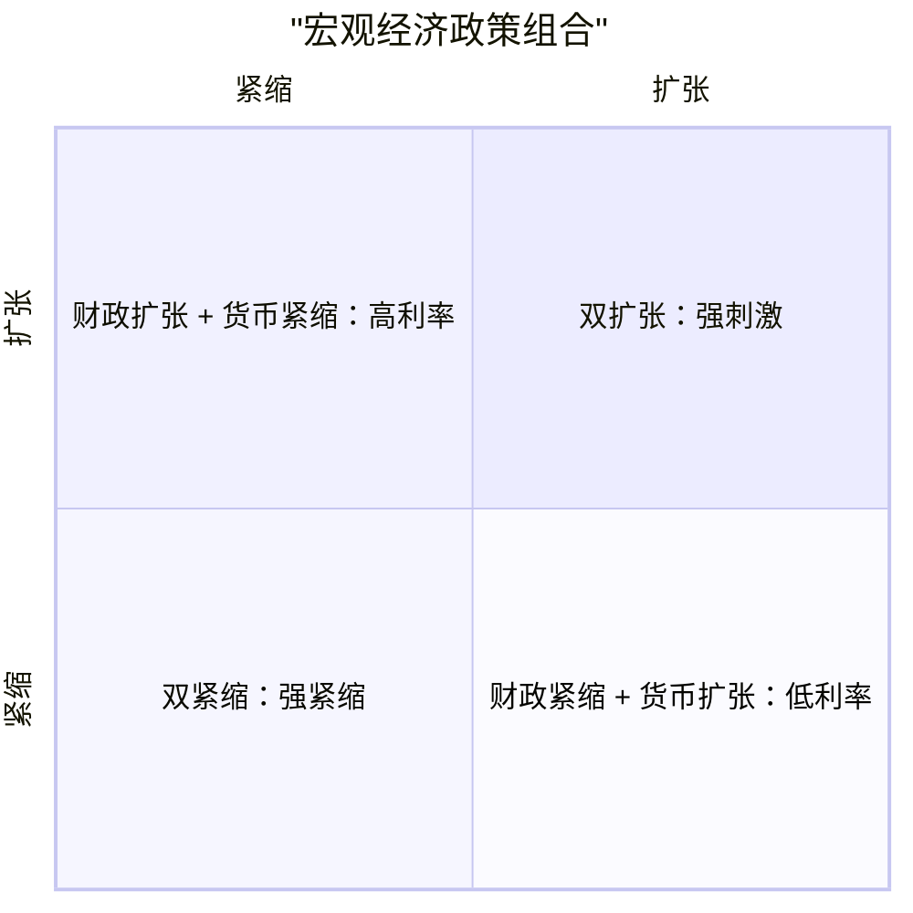
```mermaid
quadrantChart
    title "宏观经济政策组合"
    x-axis "紧缩" --> "扩张"
    y-axis "紧缩" --> "扩张"
    quadrant-1 "双扩张：强刺激"
    quadrant-2 "财政扩张 + 货币紧缩：高利率"
    quadrant-3 "双紧缩：强紧缩"
    quadrant-4 "财政紧缩 + 货币扩张：低利率"
```

---

## 五、中观经济学：产业与区域的桥梁

### 5.1 产业经济学

#### 产业结构演变流程

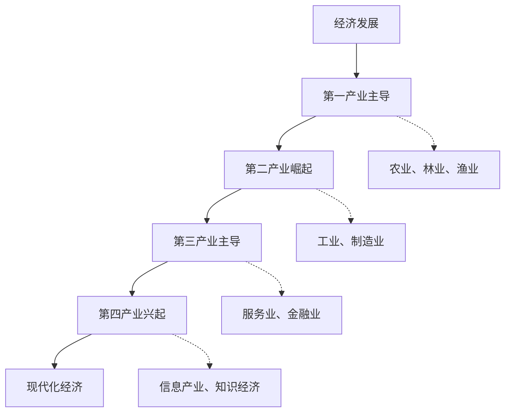
```mermaid
flowchart TD
    A[经济发展] --> B[第一产业主导]
    B --> C[第二产业崛起]
    C --> D[第三产业主导]
    D --> E[第四产业兴起]
    E --> F[现代化经济]
    
    B -.-> G[农业、林业、渔业]
    C -.-> H[工业、制造业]
    D -.-> I[服务业、金融业]
    E -.-> J[信息产业、知识经济]
```

#### 产业分类与特征

| 产业类型 | 主要行业 | 就业占比趋势 | GDP 贡献趋势 | 典型国家 |
|----------|----------|--------------|--------------|----------|
| **第一产业** | 农业、林业、牧业、渔业 | 下降 ↓ | 下降 ↓ | 发展中国家 |
| **第二产业** | 制造业、建筑业、采矿业 | 先升后降 | 先升后降 | 新兴工业化国家 |
| **第三产业** | 商业、金融、教育、医疗 | 上升 ↑ | 上升 ↑ | 发达国家 |
| **第四产业** | 信息技术、研发、咨询 | 快速上升 ↑↑ | 快速上升 ↑↑ | 美国、以色列 |

#### 各国产业结构对比（2026 年）

| 国家 | 第一产业 (%) | 第二产业 (%) | 第三产业 (%) | 发展阶段 | 特点 |
|------|-------------|-------------|-------------|----------|------|
| **美国** | 0.9 | 19 | 80 | 后工业化 | 服务业主导，科技金融领先 |
| **中国** | 7 | 39 | 54 | 工业化后期 | 制造业大国，服务业快速上升 |
| **德国** | 0.7 | 26 | 73 | 后工业化 | 制造业强国，工业 4.0 |
| **日本** | 1 | 29 | 70 | 后工业化 | 高端制造，人口老龄化挑战 |
| **印度** | 16 | 23 | 61 | 工业化中期 | 服务业超前发展，IT 外包领先 |
| **越南** | 14 | 34 | 52 | 工业化初期 | 承接产业转移，制造业快速增长 |

#### 产业结构演变规律

> **配第 - 克拉克定理**：随经济发展，劳动力从第一产业向第二、第三产业转移
> 
> **库兹涅茨法则**：第一产业比重下降，第二产业先升后降，第三产业持续上升
> 
> **钱纳里标准结构**：人均 GDP 不同阶段对应不同产业结构

### 5.2 区域经济学

#### 区域经济发展阶段

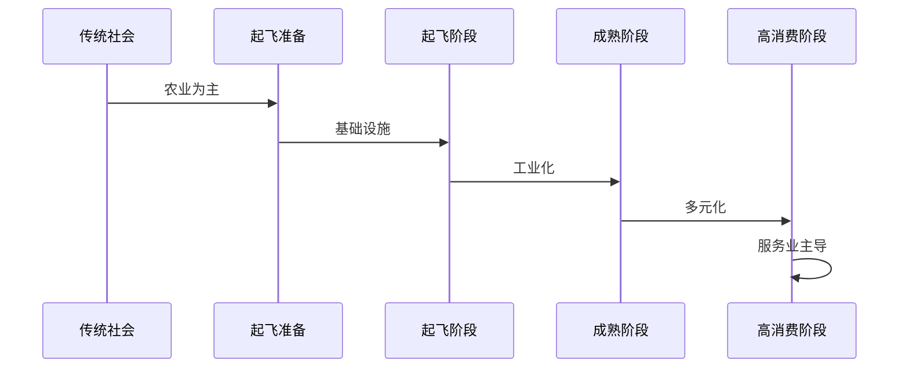
```mermaid
sequenceDiagram
    participant A as 传统社会
    participant B as 起飞准备
    participant C as 起飞阶段
    participant D as 成熟阶段
    participant E as 高消费阶段
    
    A->>B: 农业为主
    B->>C: 基础设施
    C->>D: 工业化
    D->>E: 多元化
    E->>E: 服务业主导
```

#### 区域发展典型案例

| 地区 | 发展模式 | 成功因素 | 面临挑战 | 启示 |
|------|----------|----------|----------|------|
| **中国珠三角** | 出口导向 + 产业集群 | 毗邻香港、政策优惠、劳动力充足 | 成本上升、产业转移 | 产业升级至高端制造 |
| **中国长三角** | 中心城市带动 + 产业分工 | 上海龙头、苏浙制造、人才集聚 | 区域协调、环保压力 | 一体化发展，世界级城市群 |
| **美国硅谷** | 创新驱动 + 风险投资 | 斯坦福大学、创业文化、资本密集 | 房价高企、竞争加剧 | 创新生态系统难以复制 |
| **德国鲁尔区** | 老工业基地转型 | 政府支持、产业多元化、环境治理 | 人口流失、转型缓慢 | 传统产业转型需要长期投入 |
| **印度班加罗尔** | 服务业集群 | 英语优势、工程师红利、政策支持 | 基础设施落后、制造业薄弱 | 服务业可超前发展但需配套 |

### 5.3 产业集群类型

| 集群类型 | 特征 | 典型例子 |
|----------|------|----------|
| **马歇尔式集群** | 中小企业集聚、专业化分工、知识溢出 | 意大利产业区 |
| **轮轴式集群** | 核心大企业主导、供应链配套 | 汽车产业 |
| **卫星平台式** | 外资企业主导、出口加工区、政策驱动 | 东亚模式 |

---

## 六、国际经济学：全球化时代的贸易与金融

### 6.1 国际贸易理论发展

```mermaid
flowchart LR
    A[重商主义] --> B[绝对优势理论<br/>1776]
    B --> C[比较优势理论<br/>1817]
    C --> D[H-O 模型<br/>1930s]
    D --> E[新贸易理论<br/>1970s]
    E --> F[新新贸易理论<br/>2000s]
    F --> G[全球价值链<br/>2010s-2026]
```

#### 贸易理论核心对比

| 理论 | 提出时间 | 核心观点 | 贸易基础 | 政策含义 |
|------|----------|----------|----------|----------|
| **绝对优势** | 1776 | 各国生产自己效率最高的产品 | 绝对成本差异 | 自由贸易 |
| **比较优势** | 1817 | 各国生产机会成本低的产品 | 相对成本差异 | 自由贸易 |
| **H-O 模型** | 1930s | 出口密集使用丰富要素的产品 | 要素禀赋差异 | 自由贸易 |
| **新贸易理论** | 1970s | 规模经济驱动贸易 | 规模经济、产品差异化 | 战略性贸易政策 |
| **全球价值链** | 2010s | 产品生产分散于多国 | 任务贸易、片段化生产 | 降低贸易壁垒 |

#### 比较优势原理的核心洞察

> 即使一个国家在所有产品生产上都比另一个国家更有效率（绝对优势），两国仍然可以通过贸易互惠互利。关键在于**机会成本**的差异：各国应专注于生产自己相对更擅长的产品。

**现代应用**：发达国家出口高科技产品和服务，发展中国家出口劳动密集型产品；但随着产业升级，比较优势会动态变化。

### 6.2 贸易政策与壁垒

#### 关税影响分析

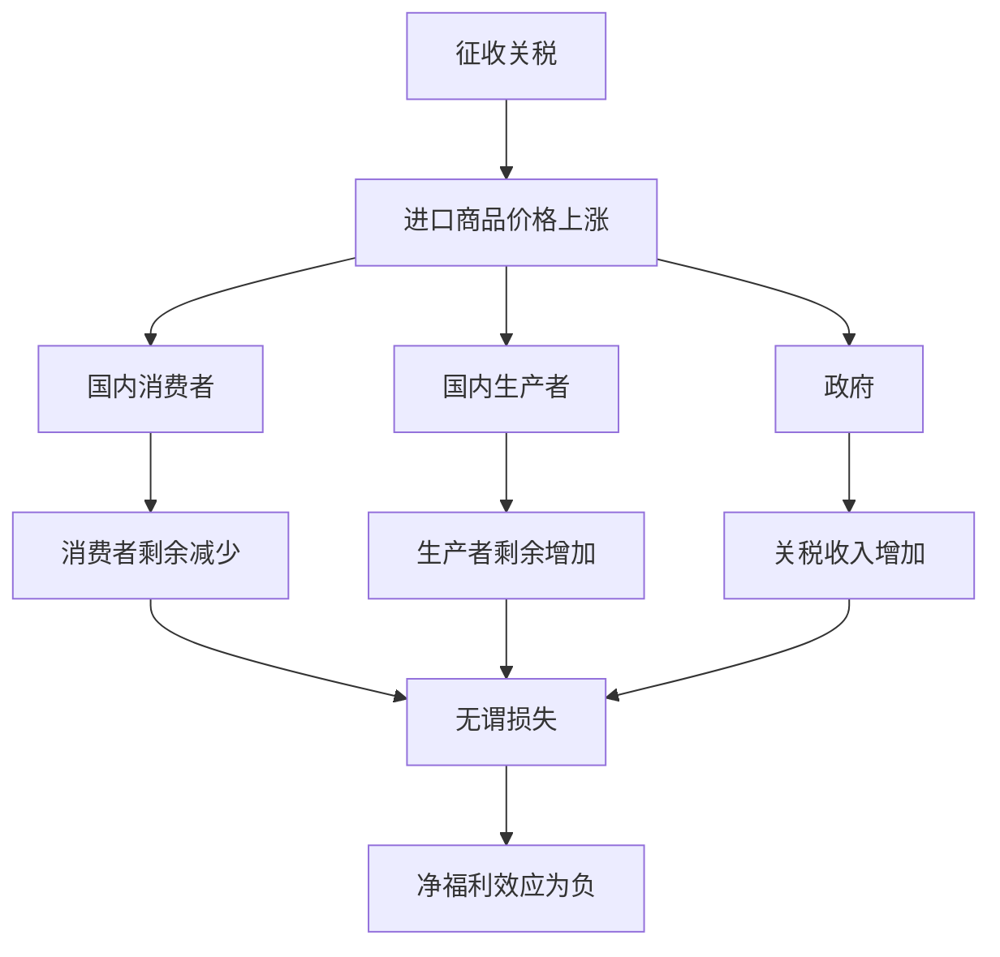
```mermaid
flowchart TD
    A[征收关税] --> B[进口商品价格上涨]
    B --> C[国内消费者]
    B --> D[国内生产者]
    B --> E[政府]
    C --> F[消费者剩余减少]
    D --> G[生产者剩余增加]
    E --> H[关税收入增加]
    F --> I[无谓损失]
    G --> I
    H --> I
    I --> J[净福利效应为负]
```

#### 2026 年贸易壁垒新趋势

| 壁垒类型 | 具体措施 | 2026 年新趋势 |
|----------|----------|---------------|
| **关税** | 从价税、从量税 | 关税战、针对性关税 |
| **技术壁垒** | 标准、认证、检验 | 碳边境调节、数据本地化 |
| **补贴** | 出口补贴、生产补贴 | 绿色补贴、芯片补贴 |
| **本地化要求** | 本地成分、技术转让 | 供应链回流、友岸外包 |
| **数字壁垒** | 数据流动限制、平台管制 | 数字税、AI 监管 |

#### 2026 年全球贸易形势

> **供应链安全优先**：疫情和地缘政治冲击后，各国重视供应链韧性，推动"友岸外包"和"近岸外包"
> 
> **产业政策回归**：美国《芯片与科学法案》、欧盟《绿色协议工业计划》、中国制造业升级
> 
> **绿色贸易壁垒**：欧盟碳边境调节机制 (CBAM)、电池法规、可持续产品倡议
> 
> **技术脱钩**：半导体出口管制、投资审查、科技竞争
> 
> **区域化加速**：RCEP、USMCA、非洲大陆自贸区，WTO 多边体制弱化

### 6.3 汇率与外汇市场

#### 汇率决定机制

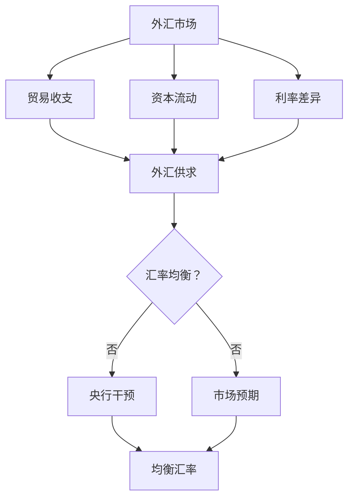
```mermaid
flowchart TD
    A[外汇市场] --> B[贸易收支]
    A --> C[资本流动]
    A --> D[利率差异]
    B --> E[外汇供求]
    C --> E
    D --> E
    E --> F{汇率均衡？}
    F -->|否 | G[央行干预]
    F -->|否 | H[市场预期]
    G --> I[均衡汇率]
    H --> I
```

#### 汇率理论对比

| 理论 | 核心观点 | 公式 | 适用期限 | 局限性 |
|------|----------|------|----------|--------|
| **购买力平价 PPP** | 汇率反映两国物价水平 | S = P₁/P₂ | 长期 | 忽略非贸易品、短期偏离大 |
| **利率平价 IRP** | 汇率与利率联动 | (F-S)/S = i₁-i₂ | 短期 | 假设资本自由流动 |
| **国际费雪效应** | 名义利率差=预期通胀差 | i₁-i₂ = π₁-π₂ | 中长期 | 预期难以观测 |
| **资产市场说** | 汇率是资产价格 | 货币供求均衡 | 短期 | 忽略经常账户 |

---

## 七、新兴经济学分支：数字、AI 与绿色革命

### 7.1 数字经济学

#### 平台经济运作机制

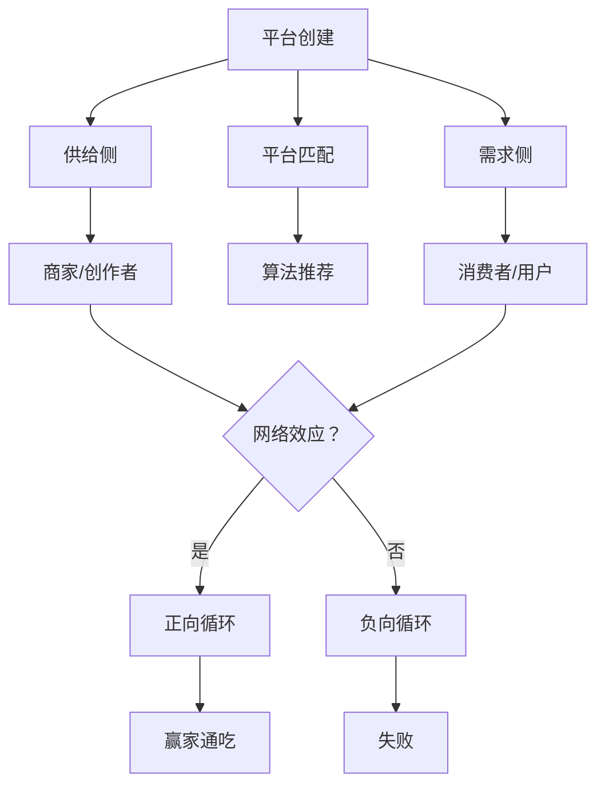
```mermaid
flowchart TD
    A[平台创建] --> B[供给侧]
    A --> C[平台匹配]
    A --> D[需求侧]
    B --> E[商家/创作者]
    C --> F[算法推荐]
    D --> G[消费者/用户]
    E --> H{网络效应？}
    G --> H
    H -->|是 | I[正向循环]
    H -->|否 | J[负向循环]
    I --> K[赢家通吃]
    J --> L[失败]
```

#### 平台经济核心特征

> **网络效应**：用户越多价值越大，形成正反馈循环
> 
> **多边市场**：同时服务多个用户群体，需平衡各方利益
> 
> **数据驱动**：用户数据优化匹配效率，形成竞争壁垒
> 
> **规模经济**：边际成本趋零，扩张成本低
> 
> **锁定效应**：转换成本高，用户粘性强

#### 双边市场定价策略

| 策略类型 | 定价方式 | 适用场景 | 2026 年案例 |
|----------|----------|----------|-------------|
| **补贴一侧** | 免费/低价吸引用户 | 用户侧价格弹性高 | 抖音免费、淘宝买家免费 |
| **交叉补贴** | 一侧收费补贴另一侧 | 两侧价格弹性差异大 | 广告商补贴用户 |
| **会员制** | 付费会员享受优惠 | 高价值用户锁定 | 亚马逊 Prime、京东 Plus |
| **动态定价** | 算法实时调整价格 | 供需波动大 | 滴滴、美团、机票 |
| **免费增值** | 基础免费、高级付费 | 转化率高 | Notion、Figma、Spotify |

#### 2026 年数据经济新趋势

> **数据要素化**：数据正式成为生产要素，纳入 GDP 核算
> 
> **数据空间**：欧盟数据空间、行业数据共享平台兴起
> 
> **隐私计算**：联邦学习、安全多方计算使数据可用不可见
> 
> **数据信托**：第三方受托管理数据，平衡利用与保护
> 
> **个人数据主权**：用户可控制、携带、删除个人数据
> 
> **AI 训练数据**：高质量数据集成为稀缺资源，版权争议加剧

### 7.2 人工智能经济学

#### AI 经济影响传导机制

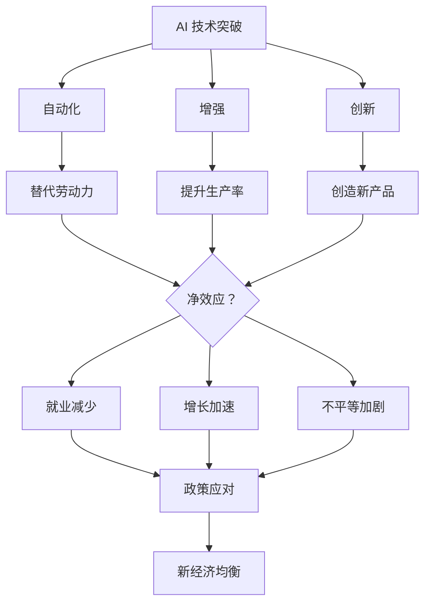
```mermaid
flowchart TD
    A[AI 技术突破] --> B[自动化]
    A --> C[增强]
    A --> D[创新]
    B --> E[替代劳动力]
    C --> F[提升生产率]
    D --> G[创造新产品]
    E --> H{净效应？}
    F --> H
    G --> H
    H --> I[就业减少]
    H --> J[增长加速]
    H --> K[不平等加剧]
    I --> L[政策应对]
    J --> L
    K --> L
    L --> M[新经济均衡]
```

#### AI 经济影响维度

| 影响维度 | 短期效应 (1-3 年) | 中期效应 (3-10 年) | 长期效应 (10 年+) | 不确定性 |
|----------|------------------|-------------------|------------------|----------|
| **生产率** | 局部提升 | 行业扩散 | 全要素生产率增长 | 吸收速度 |
| **就业** | 任务替代 | 职业重构 | 新职业创造 | 净效应方向 |
| **工资** | 技能溢价扩大 | 工资极化 | 新技能溢价 | 再培训效果 |
| **不平等** | 资本 - 劳动份额变化 | 技能分化 | 结构性不平等 | 政策响应 |
| **增长** | 投资拉动 | 生产率驱动 | 新增长范式 | 技术突破速度 |

#### 职业自动化风险评估（2026 年）

| 风险等级 | 职业类型 | 自动化潜力 | 时间框架 | 应对建议 |
|----------|----------|------------|----------|----------|
| **高风险** | 数据录入、客服、翻译、基础编程 | 70%+ | 2026-2030 | 技能转型、人机协作 |
| **中风险** | 会计、法律助理、放射科医生 | 40-70% | 2030-2035 | 增强 AI 技能、专业化 |
| **低风险** | 教师、护士、心理医生、创意工作者 | <40% | 2035+ | AI 辅助、发挥人际优势 |
| **新兴职业** | 提示工程师、AI 训练师、AI 伦理师 | 新创造 | 现在 -2030 | 早期进入、持续学习 |

#### 2026 年 AI 经济影响共识

> **生产率提升**：多数研究认为 AI 将显著提升生产率，但扩散需要时间
> 
> **就业重构**：净就业效应不确定，但职业结构将发生重大变化
> 
> **技能需求变化**：AI 互补技能（创造力、社交、复杂问题解决）价值上升
> 
> **不平等挑战**：资本回报 vs 劳动回报、高技能 vs 低技能差距可能扩大
> 
> **政策必要性**：需要教育、社保、税收等配套政策应对转型挑战

### 7.3 绿色经济学

#### 碳定价政策选择流程

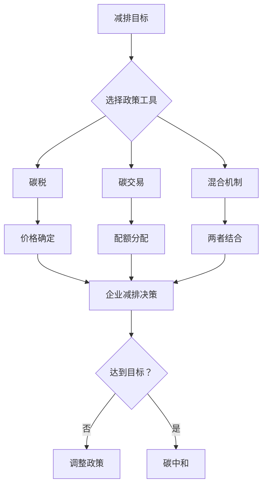
```mermaid
flowchart TD
    A[减排目标] --> B{选择政策工具}
    B --> C[碳税]
    B --> D[碳交易]
    B --> E[混合机制]
    C --> F[价格确定]
    D --> G[配额分配]
    E --> H[两者结合]
    F --> I[企业减排决策]
    G --> I
    H --> I
    I --> J{达到目标？}
    J -->|否 | K[调整政策]
    J -->|是 | L[碳中和]
```

#### 碳税 vs 碳交易对比

| 维度 | 碳税 | 碳交易 (ETS) | 混合机制 |
|------|------|--------------|----------|
| **价格确定性** | 高（税率固定） | 低（市场波动） | 中（价格上下限） |
| **排放量确定性** | 低 | 高（配额固定） | 中 |
| **行政成本** | 低（依托现有税制） | 高（需建立市场） | 中高 |
| **政治接受度** | 低（"税"敏感） | 高（"市场"机制） | 中 |
| **2026 年采用** | 欧盟、加拿大、新加坡 | 欧盟、中国、韩国 | 加州、RGGI |

#### 全球碳定价进展（2026 年）

| 地区 | 碳价 (USD/tCO₂) | 覆盖率 | 收入用途 | 2026 年动态 |
|------|----------------|--------|----------|-------------|
| **欧盟 ETS** | 80-100 | ~40% 排放 | 气候基金、创新基金 | 纳入航运、建筑 |
| **中国 ETS** | 10-15 | ~40% 排放 | 地方财政 | 扩围至钢铁、水泥 |
| **加拿大** | 50-65 | ~70% 排放 | 返还居民 | 碳价持续上升 |
| **韩国 ETS** | 20-30 | ~70% 排放 | 绿色基金 | 配额收紧 |
| **加州** | 30-40 | ~80% 排放 | 气候项目 | 与魁北克联动 |

#### 2026 年绿色金融趋势

> **强制披露**：欧盟 CSRD、美国 SEC 气候披露规则、ISSB 标准实施
> 
> **转型金融**：支持高碳行业低碳转型，避免"一刀切"撤资
> 
> **自然相关披露**：TNFD 框架推广，生物多样性纳入投资决策
> 
> **漂绿监管**：加强对 ESG 基金命名和营销的监管，防止误导
> 
> **气候压力测试**：央行和监管机构要求金融机构进行气候风险评估
> 
> **混合融资**：公共资金撬动私人资本，支持发展中国家绿色转型

---

## 八、行为经济学：当心理学遇见经济学

### 8.1 双系统理论

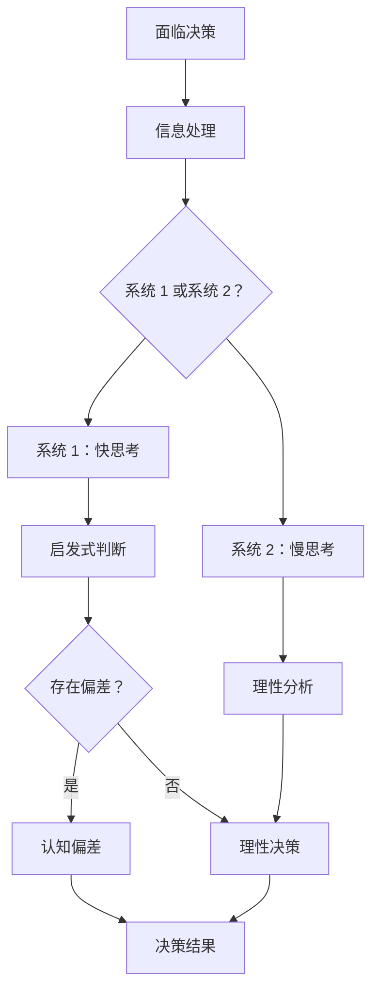
```mermaid
flowchart TD
    A[面临决策] --> B[信息处理]
    B --> C{系统 1 或系统 2？}
    C --> D[系统 1：快思考]
    C --> E[系统 2：慢思考]
    D --> F[启发式判断]
    E --> G[理性分析]
    F --> H{存在偏差？}
    G --> I[理性决策]
    H -->|是 | J[认知偏差]
    H -->|否 | I
    J --> K[决策结果]
    I --> K
```

> **系统 1（快思考）**：直觉、自动、无意识、情绪化——快速但易出错
> 
> **系统 2（慢思考）**：理性、控制、有意识、逻辑化——准确但费力
> 
> **认知偏差来源**：系统 1 的启发式判断在复杂情境下失效

### 8.2 常见认知偏差类型

| 偏差类型 | 表现形式 | 心理机制 | 经济影响 | 纠正方法 |
|----------|----------|----------|----------|----------|
| **锚定效应** | 过度依赖初始信息 | 参考点依赖 | 价格判断失真 | 多源信息对比 |
| **损失厌恶** | 损失痛苦>收益快乐 | 进化生存机制 | 风险规避过度 | 框架重构 |
| **确认偏误** | 只接受支持性信息 | 认知一致性 | 判断失误 | 主动寻找反面证据 |
| **可得性启发** | 易想起的事件高估 | 记忆可及性 | 风险评估偏差 | 统计数据参考 |
| **过度自信** | 高估自己能力 | 自我服务偏差 | 过度交易 | 记录决策结果 |
| **现状偏见** | 不愿改变现状 | 损失厌恶 + 惯性 | 次优选择持续 | 定期审视选择 |

### 8.3 助推理论与政策

#### 助推干预设计流程

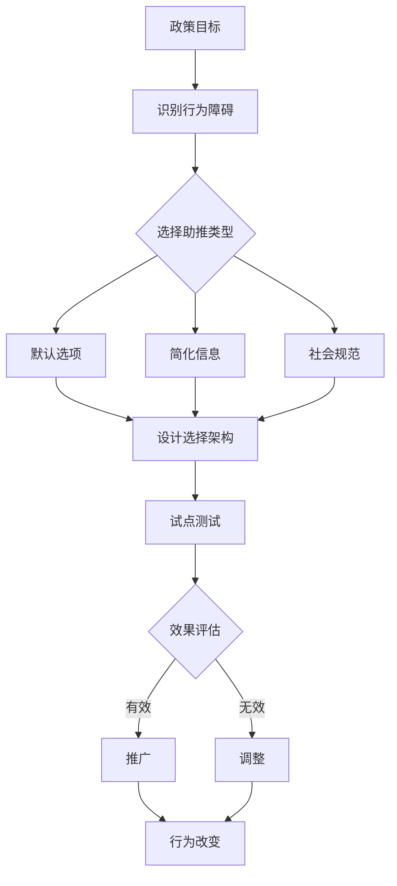
```mermaid
flowchart TD
    A[政策目标] --> B[识别行为障碍]
    B --> C{选择助推类型}
    C --> D[默认选项]
    C --> E[简化信息]
    C --> F[社会规范]
    D --> G[设计选择架构]
    E --> G
    F --> G
    G --> H[试点测试]
    H --> I{效果评估}
    I -->|有效 | J[推广]
    I -->|无效 | K[调整]
    J --> L[行为改变]
    K --> L
```

#### 助推工具对比

| 助推类型 | 机制 | 应用场景 | 效果 | 2026 年应用 |
|----------|------|----------|------|-------------|
| **默认选项** | 利用现状偏见 | 器官捐献、养老金 | 参与率 +50% | 绿色能源默认 |
| **简化信息** | 降低认知负担 | 金融产品、保险 | 理解度 +40% | AI 个性化解释 |
| **社会规范** | 从众心理 | 节能、纳税 | 行为改变 +20% | 实时比较反馈 |
| **承诺机制** | 一致性需求 | 储蓄、健身 | 坚持率 +30% | 数字承诺合约 |
| **框架效应** | 表述影响选择 | 健康、投资 | 选择改变 +25% | 个性化框架 |

### 8.4 行为金融学

#### 投资者行为偏差流程

```mermaid
flowchart TD
    A[市场信息] --> B{投资者处理}
    B --> C[认知偏差]
    B --> D[情绪影响]
    C --> E[过度自信]
    D --> F[恐惧/贪婪]
    E --> G{交易决策}
    F --> G
    G --> H[过度交易]
    G --> I[处置效应]
    G --> J[羊群行为]
    H --> K[市场结果]
    I --> K
    J --> K
    K --> L[价格偏离基本面]
```

#### 行为金融现象与解释

| 市场现象 | 传统解释 | 行为解释 | 实证证据 | 投资策略 |
|----------|----------|----------|----------|----------|
| **股市泡沫** | 理性投机 | 过度自信 + 羊群 | 历史泡沫模式 | 反向投资 |
| **波动率过高** | 信息冲击 | 情绪驱动 | 波动率溢价 | 低波动策略 |
| **动量效应** | 风险补偿 | 反应不足 | 持续存在 | 动量策略 |
| **价值溢价** | 风险因子 | 过度悲观 | 长期存在 | 价值投资 |
| **处置效应** | 税收考虑 | 损失厌恶 | 账户数据分析 | 自动再平衡 |

---

## 九、经济史：从历史看未来

### 9.1 经济思想发展历程

```mermaid
timeline
    title 经济学思想演变
    15-17 世纪 : 重商主义 : 托马斯·曼、柯尔贝尔
    1776-1870 : 古典经济学 : 亚当·斯密、李嘉图
    1867- : 马克思主义 : 马克思、恩格斯
    1870-1930 : 新古典经济学 : 马歇尔、瓦尔拉斯
    1936-1970 : 凯恩斯主义 : 凯恩斯、萨缪尔森
    1970- : 货币主义 : 弗里德曼
    1980- : 行为经济学 : 卡尼曼、塞勒
    2000-2026 : 现代多元发展 : 数字经济、AI 经济
```

#### 主要经济学派别对比

| 学派 | 时期 | 代表人物 | 核心观点 | 政策主张 |
|------|------|----------|----------|----------|
| **重商主义** | 15-17 世纪 | 托马斯·曼、柯尔贝尔 | 财富=金银，贸易顺差 | 保护主义、殖民扩张 |
| **古典经济学** | 1776-1870 | 亚当·斯密、李嘉图 | 看不见的手、比较优势 | 自由放任、自由贸易 |
| **马克思主义** | 1867- | 马克思、恩格斯 | 剩余价值、阶级斗争 | 计划经济、公有制 |
| **新古典经济学** | 1870-1930 | 马歇尔、瓦尔拉斯 | 边际效用、一般均衡 | 市场自由、最小政府 |
| **凯恩斯主义** | 1936-1970 | 凯恩斯、萨缪尔森 | 有效需求、乘数效应 | 政府干预、财政政策 |
| **货币主义** | 1970- | 弗里德曼 | 货币数量论、自然失业率 | 控制货币供应、自由市场 |
| **行为经济学** | 1980- | 卡尼曼、塞勒 | 有限理性、心理偏差 | 助推、行为干预 |

### 9.2 世界经济发展历程

#### 历次工业革命特征对比

| 工业革命 | 时间 | 核心技术 | 生产方式 | 经济影响 | 社会影响 |
|----------|------|----------|----------|----------|----------|
| **第一次** | 1760-1840 | 蒸汽机、纺织机 | 工厂制度 | GDP 增长加速 | 城市化、工人阶级 |
| **第二次** | 1870-1914 | 电力、内燃机、化学 | 大规模生产 | 垄断资本主义 | 中产阶级兴起 |
| **第三次** | 1960-2000 | 计算机、互联网 | 自动化生产 | 全球化加速 | 知识经济 |
| **第四次** | 2010-2026 | AI、物联网、区块链 | 智能制造 | 平台经济、零工经济 | 数字鸿沟、远程工作 |

#### 重大经济危机时间线

```mermaid
sequenceDiagram
    participant A as 1637:郁金香狂热
    participant B as 1929:大萧条
    participant C as 1973:石油危机
    participant D as 1997:亚洲金融危机
    participant E as 2008:全球金融危机
    participant F as 2020:新冠疫情危机
    
    Note over A,F: 经济危机周期性爆发
```

### 9.3 中国经济发展历程

#### 中国经济发展阶段

```mermaid
flowchart TD
    A[1949 新中国成立] --> B[计划经济时期<br/>1949-1978]
    B --> C[改革开放初期<br/>1978-1992]
    C --> D[市场经济确立<br/>1992-2001]
    D --> E[加入 WTO 高速增长<br/>2001-2012]
    E --> F[新常态转型升级<br/>2012-2020]
    F --> G[高质量发展<br/>2020-2026]
    G --> H[中国式现代化<br/>2026-]
```

#### 中国经济增长奇迹

| 时期 | 年均 GDP 增速 | 主要特征 | 驱动因素 | 挑战 |
|------|-------------|----------|----------|------|
| **1978-1990** | 9.2% | 农村改革、乡镇企业 | 家庭联产承包、价格双轨制 | 通胀波动、体制摩擦 |
| **1991-2000** | 10.4% | 市场经济确立、国企改革 | 分税制、国企改制、出口导向 | 下岗潮、亚洲金融危机 |
| **2001-2012** | 10.3% | 加入 WTO、高速增长 | 出口、投资、城镇化 | 环境压力、收入差距 |
| **2013-2019** | 6.8% | 新常态、转型升级 | 消费、创新、服务业 | 债务风险、贸易摩擦 |
| **2020-2026** | 5.0% | 高质量发展、双循环 | 内需、科技自立、绿色转型 | 人口老龄化、地缘政治 |

---

## 十、生活中的经济学：实用思维工具

### 10.1 理性决策流程

```mermaid
flowchart TD
    A[面临选择] --> B[识别所有选项]
    B --> C{有沉没成本？}
    C -->|是 | D[忽略沉没成本]
    C -->|否 | E[继续评估]
    D --> E
    E --> F[计算机会成本]
    F --> G[比较边际收益 vs 边际成本]
    G --> H{MB ≥ MC？}
    H -->|是 | I[执行选择]
    H -->|否 | J[放弃/调整]
    I --> K[完成决策]
    J --> K
```

### 10.2 核心决策规律

| 规律名称 | 核心内容 | 常见误区 | 正确做法 | 2026 年新应用 |
|----------|----------|----------|----------|---------------|
| **沉没成本谬误** | 已发生且无法收回的成本不应影响决策 | "已经投入这么多，不能放弃" | 只看未来成本和收益 | 订阅制服务及时取消 |
| **机会成本** | 选择的真实成本是放弃的最佳替代方案 | 只考虑金钱成本，忽略时间价值 | 计算时间的机会成本 | 远程工作 vs 通勤决策 |
| **边际分析** | 比较额外一单位的收益与成本 | 只看总量，不看边际 | MB ≥ MC 时继续 | AI 使用频率优化 |
| **激励响应** | 人会对激励做出反应 | 忽视非预期后果 | 设计合理激励机制 | 碳积分、绿色补贴 |

#### 沉没成本谬误的 2026 年新表现

> **订阅制陷阱**："已经付了年费，不用就亏了"——继续订阅不用的服务
> 
> **数字资产**："买了这么多游戏/电子书，必须看完"——强迫消费增加时间浪费
> 
> **会员等级**："已经是白金会员了，要多消费保级"——为保级而过度消费
> 
> **加密货币**："已经亏了 50%，卖了就真亏了"——拒绝止损导致更大损失

**应对策略**：定期审视订阅、设置自动取消提醒、建立止损规则、问自己"如果现在没拥有，还会买吗？"

### 10.3 市场运行规律

#### 供需均衡机制

```mermaid
flowchart TD
    A[市场冲击] --> B[需求增加]
    A --> C[供给增加]
    B --> D[供不应求]
    C --> E[供过于求]
    D --> F[价格上涨 ↑]
    E --> G[价格下跌 ↓]
    F --> H[供给增加，需求减少]
    G --> I[供给减少，需求增加]
    H --> J[新均衡点]
    I --> J
```

#### 常见市场规律

| 规律名称 | 提出时间 | 核心内容 | 现实例子 | 局限性 |
|----------|----------|----------|----------|--------|
| **供需定律** | 1776 | 价格由供给和需求决定 | 疫情口罩价格波动 | 短期价格粘性 |
| **格雷欣法则** | 1560 | 劣币驱逐良币 | 二手车市场、内容平台 | 信息透明可逆转 |
| **公地悲剧** | 1968 | 公共资源被过度使用 | 渔业资源、碳排放 | 需要产权或监管 |
| **搭便车问题** | 1954 | 非贡献者享受公共物品 | 开源软件、公共广播 | 需要强制或激励 |
| **网络效应** | 1980 | 用户越多价值越大 | 微信、抖音、淘宝 | 可能形成垄断 |

#### 梅特卡夫定律

> 网络价值与用户数平方成正比：**V ∝ n²**
> 
> 解释平台经济赢家通吃：微信 10 亿用户价值巨大

#### 长尾理论

> 利基市场总和超过热门市场
> 
> 互联网降低存储分销成本
> 
> 亚马逊、Netflix 成功关键
> 
> 小众内容也有商业价值

### 10.4 消费心理陷阱与应对

| 心理效应 | 表现形式 | 商家利用方式 | 应对策略 | 2026 年新趋势 |
|----------|----------|--------------|----------|---------------|
| **锚定效应** | 被第一个看到的价格影响 | 先展示高价再打折 | 多渠道比价 | AI 动态定价更隐蔽 |
| **稀缺效应** | 怕错过 (FOMO) | 限时限量、倒计时 | 设置冷静期 | 直播带货强化紧迫感 |
| **从众效应** | 跟风购买 | 销量展示、网红推荐 | 独立思考需求 | 社交媒体种草经济 |
| **沉没成本** | 不愿放弃已投入的 | 会员制、预付卡 | 向前看决策 | 订阅制经济普及 |
| **免费效应** | 高估免费物品价值 | 包邮、买一送一 | 计算真实成本 | 免费增值模式盛行 |

#### 2026 年消费新陷阱

> **算法推荐茧房**：AI 根据你的偏好精准推送，让你只看到想买的商品
> 
> **先买后付 (BNPL)**：分期付款降低支付痛感，诱导过度消费
> 
> **虚拟商品消费**：游戏皮肤、NFT、虚拟偶像打赏，无实物消费增长
> 
> **订阅制陷阱**：各种会员自动续费，累积支出可观
> 
> **直播带货冲动**：主播话术 + 限时优惠，冲动消费高发场景

### 10.5 时间管理与机会成本

#### 时间的机会成本计算

| 活动 | 时间投入 | 直接成本 | 机会成本 | 长期收益 | 建议 |
|------|----------|----------|----------|----------|------|
| **刷短视频** | 2 小时/天 | 0 元 | 学习/工作时间 | 几乎为零 | 限制在 30 分钟内 |
| **学习新技能** | 1 小时/天 | 课程费 | 娱乐时间 | 收入提升、职业发展 | 优先投资 |
| **健身运动** | 1 小时/天 | 装备/会员 | 休闲时间 | 健康、减少医疗支出 | 必要投资 |
| **自己做饭** | 1 小时/天 | 食材费 | 工作/学习时间 | 健康、省钱 | 平衡外卖与自制 |
| **通勤** | 2 小时/天 | 交通费 | 可支配时间 | 无 | 利用时间学习/休息 |

#### 时间价值公式

> **时间价值 = 年收入 ÷ (工作日×工作小时)**
> 
> 例：年薪 30 万÷(250 天×8 小时) = 150 元/小时
> 
> **低于此价值的任务可考虑外包**

### 10.6 个人投资理财

#### 投资工具对比（2026 年）

| 投资类型 | 预期年化收益 | 风险等级 | 流动性 | 2026 年新特点 | 适合人群 |
|----------|-------------|----------|--------|---------------|----------|
| **银行存款** | 1-3% | 极低 | 高 | 数字银行利率竞争 | 保守型、应急资金 |
| **货币基金** | 2-4% | 低 | 高 | T+0 赎回普及 | 现金管理 |
| **债券基金** | 3-6% | 中低 | 中 | 绿色债券兴起 | 稳健型投资者 |
| **指数基金** | 7-10% | 中高 | 高 | 主题 ETF 多样化 | 长期定投 |
| **股票** | 不定 | 高 | 高 | AI 股、新能源热门 | 有经验投资者 |
| **REITs** | 4-8% | 中 | 中 | 基础设施 REITs 扩容 | 配置房地产 |
| **黄金** | 不定 | 中 | 中 | 避险需求增加 | 对冲通胀 |

---

## 结语：经济学思维的力量

经济学不仅仅是一门学科，更是一种**思维方式**。它教会我们：

1. **权衡取舍**：资源稀缺意味着任何选择都有成本
2. **边际思考**：关注增量变化而非总量
3. **激励响应**：理解人们如何对激励做出反应
4. **机会成本**：考虑放弃的替代方案
5. **比较优势**：专注于自己相对擅长的事
6. **长期视角**：区分短期波动与长期趋势

在 2026 年这个充满变革的时代——AI 重塑就业、绿色转型重构产业、地缘政治改变贸易——掌握经济学思维比以往任何时候都更加重要。

> **学习建议**：
> 1. **理论学习**：掌握基本概念和原理，理解模型假设和结论
> 2. **数学工具**：微积分、线性代数、概率统计、优化理论
> 3. **实证分析**：数据分析能力、计量软件使用、因果推断方法
> 4. **理论联系实际**：关注经济新闻、分析现实问题、案例研究

经济学不是关于给出正确答案，而是关于**提出正确的问题**。希望这份指南能成为你经济学学习之旅的起点。

---

**参考资料**：本文内容基于经济学学习平台（https://money-tutorial.pages.dev）的核心课程内容整理而成，涵盖微观经济学、宏观经济学、中观经济学、国际经济学、数字经济学、人工智能经济学、绿色经济学、行为经济学、经济史及日常生活经济学等多个分支。

**版权声明**：本文内容仅供学习参考，欢迎分享传播。
